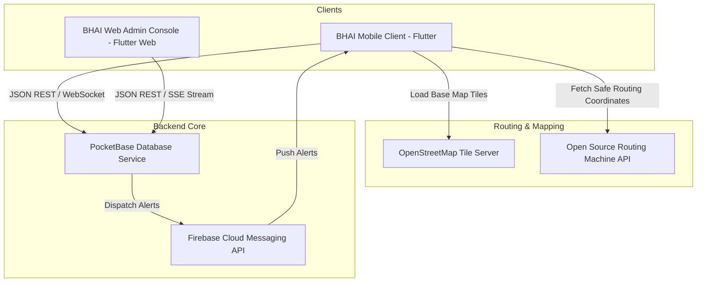

# BHAI: "Your Brother is Always With You"

BHAI is an enterprise-grade, modern, secure, and AI-powered women safety suite built to coordinate rapid SOS dispatches, background location sharing, off-grid safety calculations, and a spatial-matching **Volunteer Protection Network**. 

The system comprises three main layers:
1. **BHAI Mobile App**: A cross-platform Flutter application (iOS and Android) implementing Riverpod state management, GoRouter, local Hive settings cache, SQLite offline sync queue, OpenStreetMap base rendering, OSRM safe route optimization, and wake-word/shake SOS detection.
2. **BHAI Web Admin**: A Flutter Web dashboard allowing emergency operators and regional administrators to view active dispatch requests, track live location paths, and manage India state-wise helpline catalogs.
3. **BHAI Backend**: A Dockerized, self-hosted PocketBase application coordinating JWT sessions, location telemetry indexes, and high-priority push notifications using Firebase Cloud Messaging (FCM).

---

## 🗺️ System Architecture



---

## 🔒 Security & Platform Fallback Guidelines

### 1. Data Encryption (AES-256)
Personal details, emergency contacts, medical records, and custom notes are encrypted locally before syncing. The device generates a random 256-bit key on first-run and stores it in the platform secure keychain (`flutter_secure_storage`).

### 2. Platform Fallbacks (Compliance Rules)
* **Background SMS (Android vs iOS)**: On Android, the app sends background silent SMS to trusted contacts using the `telephony` API. On iOS, due to Apple sandbox constraints, the app automatically prepares the system message composer with pre-filled locations for one-tap dispatch.
* **WhatsApp SOS Alert**: Opens a deep link `https://wa.me/?text=...` pre-populating message contents (with live location link) so users can tap and send.
* **Power Button Capture**: Background monitoring of physical keys is sandboxed. We listen to screen lock/unlock transitions and count 5 toggle transitions within 5 seconds to activate the SOS mode.

---

## 🗄️ Database Collections Schema (PocketBase)

### 1. `users` (Auth)
* `name` (text, required): Minimum 2 characters.
* `age` (number): User age.
* `gender` (select): Female, Male, Other, Prefer not to say.
* `blood_group` (select): A+, A-, B+, B-, AB+, AB-, O+, O-.
* `medical_condition` (text): Known medical alerts.
* `emergency_notes` (text): Encrypted details (allergies, notes).
* `language` (select, required): Interface translation language choice.
* `role` (select, required): `user` or `admin`.

### 2. `emergency_contacts` (Base)
* `user` (relation, Cascade Delete): Relates to `users`.
* `name` (text, required): Contact name.
* `phone` (text, required): Targeted phone number for SMS triggers.
* `priority` (number, required): Priority hierarchy index (1 to 5).
* `relationship` (text, required): Contact relationship (e.g., Dad, Brother).

### 3. `emergency_events` (Base)
* `user` (relation): SOS creator user.
* `status` (select): `active` or `resolved`.
* `start_time` (date): Timestamp when SOS was triggered.
* `end_time` (date): Resolution timestamp.
* `initial_latitude` / `initial_longitude` (number).
* `initial_address` (text).

### 4. `locations` (Base)
* `event` (relation, Cascade Delete): Link to active `emergency_event`.
* `latitude` / `longitude` (number, required).
* `timestamp` (date, required).
* `battery_level` (number) & `network_status` (text).

---

## 🚀 Setup & Deployment Guide

### Prerequisites
* Flutter SDK (v3.0.0 or higher)
* Dart SDK (v3.0.0 or higher)
* Docker and Docker Compose (for backend hosting)

### 1. Run Backend Locally (Docker)
Ensure your shell path is inside the `/backend` directory:
```bash
# Build the pocketbase image and spin up the container
docker-compose up --build -d

# Verify that the server is listening
curl http://localhost:8080/api/health
```
Access the PocketBase Admin panel at `http://localhost:8080/_/` to import `pb_schema.json`.

### 2. Run Mobile Client (BHAI App)
```bash
cd bhai_app

# Fetch dependency packages
flutter pub get

# Launch unit & widget test suites
flutter test

# Run app on connected emulator or physical device
flutter run
```

### 3. Run Web Admin Dashboard (BHAI Admin)
```bash
cd bhai_admin

# Fetch dependency packages
flutter pub get

# Run admin dashboard locally on web port
flutter run -d chrome
```

---

## 🛠️ Production Build Compiling

### Android APK and App Bundle (AAB)
```bash
cd bhai_app
flutter build apk --release
flutter build appbundle --release
```
Compiled targets will be outputted under `build/app/outputs/flutter-apk/app-release.apk`.

### Web Admin Compilation
```bash
cd bhai_admin
flutter build web --release
```
Static web assets will be exported under the `build/web` directory, ready to be hosted on free platforms like Oracle Cloud, Render, or GitHub Pages.
